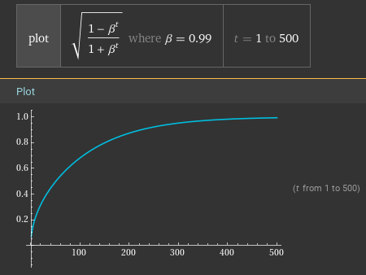

# qlora-pipe-lite

A streamlined fork of [qlora-pipe](https://github.com/tdrussell/qlora-pipe) focused on Control Adapter training.

**Key Features:**
- **Multiple Training Modes**: LoRA, QLoRA, full fine-tuning, and Control Adapters
- **Pipeline Parallelism**: Train models too large for single GPU memory using DeepSpeed
- **Memory Optimisation**: 4-bit quantisation, activation checkpointing, tied embedding weights
- **Custom LoRA Regularisation**: Composite matrix weight decay on `W = B·A` instead of separate `A`, `B` penalties
- **Optimised Kernels**: Triton-based cross-entropy loss with large vocabulary support
- **Production Features**: Checkpointing, distributed training, monitoring, LoRA merging
- **Data Processing**: Multiple formats (text/JSON/parquet), tokenisation control, sequence slicing, caching

Read the [Control Adapter documentation](docs/ControlAdapters.md) for implementation details.

Configuration examples for all training modes are available in the [examples](examples) folder.

## Table of Contents

- [Quick Start](#quick-start)
- [Training Modes](#training-modes)
- [Configuration Reference](#configuration-reference)
- [Pipeline Parallelism](#pipeline-parallelism)
- [Data Processing](#data-processing)
- [Utility Tools](#utility-tools)
- [Monitoring and Analysis](#monitoring-and-analysis)
- [Advanced Topics](#advanced-topics)
- [Troubleshooting](#troubleshooting)
- [Credits](#credits)

## Quick Start

### Prerequisites

- Python 3.8+
- PyTorch 2.0+
- HuggingFace transformers < 4.53.0 (breaking change introduced in [v4.53.0](https://github.com/huggingface/transformers/releases/tag/v4.53.0) via [PR #37866](https://github.com/huggingface/transformers/pull/37866))
- CUDA-capable GPU(s)
- DeepSpeed

### Installation

```bash
git clone https://github.com/jukofyork/qlora-pipe-lite
cd qlora-pipe-lite
pip install -r requirements.txt
```

### Basic LoRA Training

1. **Create a configuration file** (`config.toml`):

```toml
# Model and paths
model_dir = "/path/to/your/model"
output_dir = "./training_output"

# LoRA settings
lora_rank = 16
lora_dropout = 0.1
lora_weight_dtype = "float32"
lora_weight_decay = 10.0

# Training parameters
lr = 2e-5
epochs = 1
sequence_len = 4096
gradient_accumulation_steps = 8

# Pipeline parallelism
pipeline_stages = 1

# Dataset
[[datasets]]
dataset_path = "data/training_data.jsonl"
```

2. **Start training**:

```bash
# Single GPU
deepspeed --num_gpus=1 train.py --config config.toml

# Multi-GPU pipeline parallel
deepspeed --num_gpus=4 train.py --config config.toml

# Resume from checkpoint
deepspeed --num_gpus=4 train.py --config config.toml --resume_from_checkpoint
```

Optional CLI flags:

- `--add-prefix-space`: Add a prefix space when tokenising (useful for some tokenisers)
- `--trust-remote-code`: Allow custom code execution for non-standard architectures


3. **Monitor progress**:

```bash
tensorboard --logdir ./training_output
```

### Quick Examples

**QLoRA (4-bit quantised LoRA)**:

```toml
load_in_4bit = true
lora_rank = 16
```

**Full Fine-tuning**:

```toml
full_fine_tune = true
target_modules = ["q_proj", "v_proj"]  # Optional: target specific modules
layers_to_transform = "16:31"          # Optional: target specific layers
```

## Training Modes

### LoRA (Low-Rank Adaptation)

LoRA adds trainable low-rank matrices to frozen base model weights: `W_new = W_original + BA`

**Configuration**:

```toml
lora_rank = 16                    # Adapter rank (bottleneck dimension)
lora_dropout = 0.1                # Dropout on adapter weights
lora_weight_dtype = "float32"     # Use float32 for stability with weight decay
lora_weight_decay = 10.0          # L2 regularisation on composite matrix W=BA

# Optional targeting
target_modules = ["q_proj", "k_proj", "v_proj", "o_proj"]
layers_to_transform = "0:31"      # Apply to layers 0-31 (inclusive)
```

**Key Points**:

- Uses composite matrix regularisation: `L = ½||BA||²_F` instead of separate `A`, `B` penalties
- Requires `float32` precision for effective weight decay (avoids catastrophic cancellation)
- Default `lora_alpha = lora_rank` (adjust learning rate instead of alpha)
- If `target_modules` is omitted, it defaults to `"all-linear"`; you may also explicitly set `target_modules = "all-linear"`.

### QLoRA (Quantised LoRA)

Combines LoRA with 4-bit quantisation for maximum memory efficiency:

```toml
load_in_4bit = true               # Enable 4-bit quantisation
lora_rank = 16
lora_weight_dtype = "float32"     # LoRA weights remain in float32
```

**Benefits**:

- Approximately 75% reduction in model weight memory usage
- Maintains training quality with float32 adapters
- Enables training of larger models on limited hardware

### Full Fine-tuning

Updates all model parameters with optional targeting:

```toml
full_fine_tune = true

# Optional: target specific modules/layers
target_modules = ["q_proj", "v_proj", "down_proj"]
layers_to_transform = "16:31"
```

**Key Points**:

- Uses `bfloat16` for memory efficiency (`float16` has too many issues with gradient accumulation to be useful for training)
- No weight decay (would suffer from catastrophic cancellation in `bfloat16` precision, making it ineffective)
- Supports tied embedding weights with automatic gradient synchronisation via DeepSpeed's `TiedLayerSpec`

## Configuration Reference

### Core Settings

```toml
# Model and output paths
model_dir = "/path/to/model"
output_dir = "/path/to/output"

# Training parameters
lr = 2e-5                         # Learning rate
epochs = 1                        # Number of training epochs
sequence_len = 4096               # Fixed sequence length (must be multiple of 64)
gradient_accumulation_steps = 8   # Micro-batches per optimiser step

# Pipeline configuration
pipeline_stages = 1               # Number of pipeline stages (must divide world_size)
partition_method = "uniform"      # "uniform", "parameters", or "type:regex"
```

NOTE:

- The micro-batch size per GPU is fixed internally to 1.
- Effective batch size = `gradient_accumulation_steps` × `data_parallel_world_size`.

### Advanced Optimiser Settings

```toml
# Optimiser configuration (uses optimi.Adam with Kahan summation)
beta1 = 0.9                       # Default: 0.9
beta2 = 0.99                      # Default: 0.99  
eps = 1e-6                        # Default: 1e-6
```

NOTE:

- We use [optimi's Kahan summation](https://optimi.benjaminwarner.dev/kahan_summation) to make pure low precision training match mixed-precision training.
- By default, [optimi's Adam optimiser](https://optimi.benjaminwarner.dev/optimizers/adam) will automatically use Kahan summation for any layers training in `bfloat16` or `float16`.
- The code also uses a custom `beta2`-based learning rate scheduler (see [Custom Learning Rate Scheduling](#custom-learning-rate-scheduling) below).

### Evaluation and Checkpointing

```toml
# Evaluation settings
eval_fraction = 0.01                  # Fraction of data for evaluation
evals_per_epoch = 10                  # Evaluations per epoch
eval_gradient_accumulation_steps = 1  # Separate setting for evaluation

# Checkpointing
checkpoint_interval_hours = 1         # Time-based checkpoint frequency
max_checkpoints = 3                   # Maximum checkpoints to retain
```

### Memory and Performance Tuning

```toml
# Memory optimisation
load_in_4bit = true                   # Enable 4-bit quantisation
use_column_major_topology = true      # Optimise for mixed interconnects

# Data processing
max_sequences = 1000000               # Limit total sequences
drop_tails = false                    # Drop incomplete document tails
mix_datasets = false                  # Allow cross-dataset sequence mixing
```

## Pipeline Parallelism

### Basic Concept

Pipeline parallelism splits the model vertically across GPUs:

```
GPU 0: [Embedding] → [Decoder Layers 0-7]
GPU 1: [Decoder Layers 8-15] → [Decoder Layers 16-23]  
GPU 2: [Decoder Layers 24-31] → [Norm] → [LM Head] → [Loss]
```

### Configuration

```toml
pipeline_stages = 3                       # Split model across 3 GPUs
partition_method = "uniform"              # How to distribute layers

# Partitioning strategies:
# partition_method = "uniform"            # Balance number of layers per stage (default)
# partition_method = "parameters"         # Balance number of trainable parameters per stage
# partition_method = "type:decoderlayer"  # Balance layers whose class names match regex
```

### Multi-Node Setup

For multi-node training, ensure:

1. **Shared filesystem**: All nodes need access to the same model, dataset and output paths
2. **SSH access**: Passwordless SSH between nodes needs to be set up (see [this guide](https://www.strongdm.com/blog/ssh-passwordless-login))

See [Training On Multiple Nodes With DeepSpeed](https://nlp.stanford.edu/mistral/tutorials/deepspeed.html) for details on how to setup `/job/hostfile` on the `"master"` node.

```bash
# Multi-node example
deepspeed --num_gpus=8 --num_nodes=2 --master_addr=node0.cluster.local train.py --config config.toml
```

### Topology Optimisation

For mixed interconnect environments (PCIe + InfiniBand):

```toml
use_column_major_topology = true
```

This optimisation can be useful for LoRAs as it routes:
- **High-bandwidth activations** over fast PCIe/NVLink
- **Low-bandwidth gradients** over slower network interconnects

## Data Processing

### Dataset Configuration

Support for multiple formats and sophisticated preprocessing:

```toml
[[datasets]]
dataset_path = "data/train/*.json"
max_tokens = 1000000               # Limit dataset size

[[datasets]]
dataset_path = "data/text/*.txt"
```

### Supported Formats

- **Text files** (`.txt`): Raw text, one document per file
- **JSON/JSONL** (`.json`, `.jsonl`): Structured data with `"text"` field
- **Parquet** (`.parquet`): Columnar format with `"text"` field

### Advanced Processing Options

```toml
# Sequence initialisation
sequence_prefix = "<BOS>"         # String to encode as prefix tokens
# sequence_prefix = 123           # Single token ID
# sequence_prefix = [123, 456]    # Multiple token IDs

# Document suffixes (applied during tokenisation)
document_suffix = "<EOT>"         # String suffix before tokenisation
# document_suffix = 123           # Token ID after tokenisation
# document_suffix = [123, 456]    # Multiple token IDs

# Token masking (sets labels = -100 for loss exclusion)
mask_tokens = true                # Mask all special tokens
# mask_tokens = 123               # Mask specific token
# mask_tokens = [123, 456]        # Mask multiple tokens
```

### Distributed Data Loading

The framework implements distributed data loading with per-rank sampling, remainder truncation to ensure complete global batches, stateful iteration for checkpoint/resume support, and memory-efficient pinned memory allocation.

## Utility Tools

### Model Conversion and Merging

**Merge LoRA into base model**:

```bash
python merge_lora.py \
  --input /path/to/base_model \
  --adapter /path/to/lora_adapter \
  --output /path/to/merged_model \
  --scale 1.0
```

**Convert DeepSpeed checkpoints to LoRA**:

```bash
python convert_ds_checkpoint.py \
  --input /path/to/ds_checkpoint \
  --config /path/to/config.toml \
  --output /path/to/lora_adapter
```

## Monitoring and Analysis

### TensorBoard Metrics

Monitor training progress via TensorBoard:

```bash
tensorboard --logdir /path/to/output_dir --host 0.0.0.0
```


**Available metrics**:
- `eval/loss`: Evaluation loss with percentage changes
- `train/loss`: Training loss progression
- `train/lr`: Learning rate schedule
- `train/norms_{avg,min,max}`: LoRA adapter norm statistics
- `train/weight_decay_{avg,min,max}`: LoRA regularisation effectiveness

### Training Progress Monitoring

Console output provides real-time metrics:

```
[2024-01-15 14:30:25.123] [INFO] [qlora-pipe-lite] step: 100 / 1000, loss: 2.3456, lr: 1.95e-05, throughput: 42.3 sequences/s, elapsed: 5m30s, eta: 45m12s
```

## Advanced Topics

### Custom Cross-Entropy Kernel

The framework includes [Unsloth](https://github.com/unslothai/unsloth)'s optimised Triton cross-entropy loss kernel (`kernels/cross_entropy_loss.py`) that handles large vocabularies (>65K tokens) via chunking, uses numerically stable LogSumExp implementation, and provides fused forward/backward passes for memory efficiency.

### Memory Optimisation Techniques

The framework uses several memory optimisation techniques:

**Activation Checkpointing**: Uses [Unsloth](https://github.com/unslothai/unsloth)'s CPU offloading strategy with automatic application to decoder layers. The system patches BitsAndBytes for safe CPU↔GPU transfers when using 4-bit quantisation.

**Tied Weight Support**: Implements proper parameter sharing for embedding/output layers using DeepSpeed's `TiedLayerSpec` with automatic gradient synchronisation across pipeline stages.

### Custom LoRA Weight Decay Implementation

This framework addresses two fundamental issues with standard LoRA weight decay:

**The Problems**:

1. **Catastrophic cancellation**: Tiny weight decay amounts cancel to zero with `float16`/`bfloat16` precision
2. **Wrong target**: Should regularise the actual learned transformation `W = B @ A`, and **not** the individual `A` and `B` matrices

**The Solutions**:

1. **Use `float32` precision** for numerical stability when `lora_weight_decay > 0`

2. **Composite matrix regularisation**: Instead of penalising `A` and `B` separately, regularise the composite matrix `W = B @ A`:

Use `Adam` (not `AdamW`) for the primary loss gradients, then manually apply decoupled weight-decay updates to target the actual learned transformation:

```
W = BA
grad_A = B^T W  
grad_B = W A^T

A ← A - α λ grad_A
B ← B - α λ grad_B
```

where `α` is the learning rate and `λ` is the weight decay coefficient.

### Custom Learning Rate Scheduling

This framework uses a custom "RMS ratio" learning rate scheduler instead of traditional warmup.

#### The Math

The scheduler applies a scaling factor based on the optimiser's `beta2` parameter:

```
lr_scale(t) = sqrt((1 - β₂^t) / (1 + β₂^t))
```

where `t` is the training step and `β₂` is the second moment decay rate (default: `0.99`).

This schedule:

- **Starts low** (0 at step 0) for gradual warmup
- **Gradually increases** as training progresses  
- **Converges** to 1.0 in the long term



#### Theoretical Foundation

The mathematical motivation comes from analysing the uncertainty in Adam's second moment estimates. When Adam uses `β₁ = 0`, it becomes similar to bias-corrected RMSprop. Under idealised assumptions (stationary, normally distributed gradients), the [coefficient of variation](https://en.wikipedia.org/wiki/Coefficient_of_variation) of the bias-corrected second moment estimate is:

```
CV[v̂_t] = sqrt(2(1 + β₂^t)/(1 - β₂^t))
```

This expression quantifies how the relative uncertainty in our variance estimate changes over time due to the [exponential moving average](https://en.wikipedia.org/wiki/Exponential_smoothing) having fewer samples in its "memory" early in training.

In the limit as `t → ∞`:

```
CV[v̂_∞] = sqrt(2)
```

Taking the reciprocal of the coefficient of variation and normalising by `sqrt(2)` gives our learning rate schedule - essentially scaling the learning rate inversely to the uncertainty in our second moment estimates.

#### Why This Approach?

**Inspired by RAdam**: This implements the bias correction from [RAdam](https://arxiv.org/abs/1908.03265) as a learning rate schedule rather than modifying the optimiser directly.

**No Warmup Needed**: The RMS ratio naturally handles early training dynamics without requiring separate warmup phases.

#### No Cosine Annealing

We deliberately avoid cosine annealing for two practical reasons:

1. **Limited benefit**: Cosine annealing provides minimal improvement for small-dataset fine-tuning scenarios
2. **Training flexibility**: Without cosine annealing, you can:

```toml
epochs = 1  # Start with 1 epoch
```

Then extend training seamlessly using the `--resume_from_checkpoint` command line option:

```toml
epochs = 2
```

```bash
deepspeed train.py --config config.toml --resume_from_checkpoint
```

With cosine annealing, the learning rate would reset incorrectly when resuming, breaking the schedule.

#### Configuration

The scheduler automatically uses your optimiser's `beta2` setting:

```toml
beta2 = 0.99  # Controls the RMS ratio curve (default: 0.99)
lr = 2e-5     # Base learning rate (gets scaled by the ratio)
```

No additional scheduler parameters are needed or supported.

## Troubleshooting

### Common Issues

**Out of Memory**: Enable 4-bit quantisation (`load_in_4bit = true`), reduce sequence length/batch size, or increase pipeline stages.

**Poor Convergence**: Check learning rate (typical range: `1e-5` to `5e-5`), verify data quality and format, monitor for gradient explosion via sudden loss spikes.

**Pipeline Issues**: Ensure `pipeline_stages` divides `world_size` evenly, verify all nodes can access model/data paths, check network connectivity for multi-node setups.

**RTX 4000 Series GPUs** may need one or both of these environment variables setting:

```bash
export NCCL_P2P_DISABLE="1"
export NCCL_IB_DISABLE="1"
deepspeed --num_gpus=4 train.py --config config.toml
```

### Validation Steps

**Before training**: Verify dataset format and paths, test configuration with a small dataset, check GPU memory usage with target batch size.

**During training**: Monitor loss convergence, verify checkpoint saving/loading works correctly.

**After training**: Test inference with merged models, validate outputs on held-out data.

**For LoRA training specifically**: Monitor norm stability (should converge), watch for gradient explosion (sudden loss spikes), verify effective batch size via throughput metrics.


## Credits

- **[tdrussell](https://github.com/tdrussell)** - Original author of [qlora-pipe](https://github.com/tdrussell/qlora-pipe)
- **[Daniel Han-Chen & Unsloth team](https://github.com/unslothai/unsloth)** - Cross-entropy kernel and checkpoint utilities

## License

This project is licensed under the MIT License - see the [LICENSE](LICENSE) file for details.